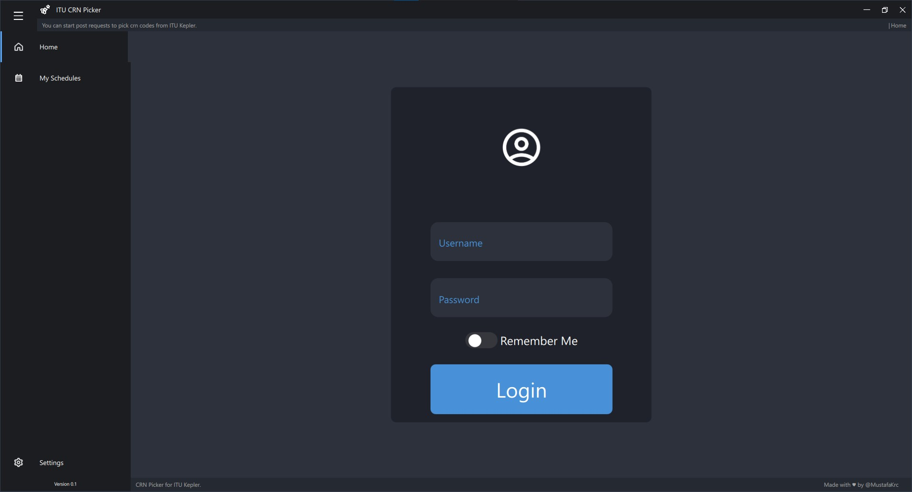
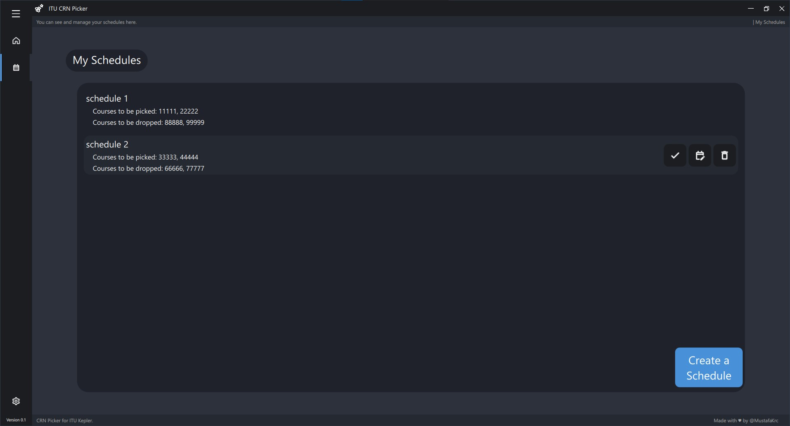
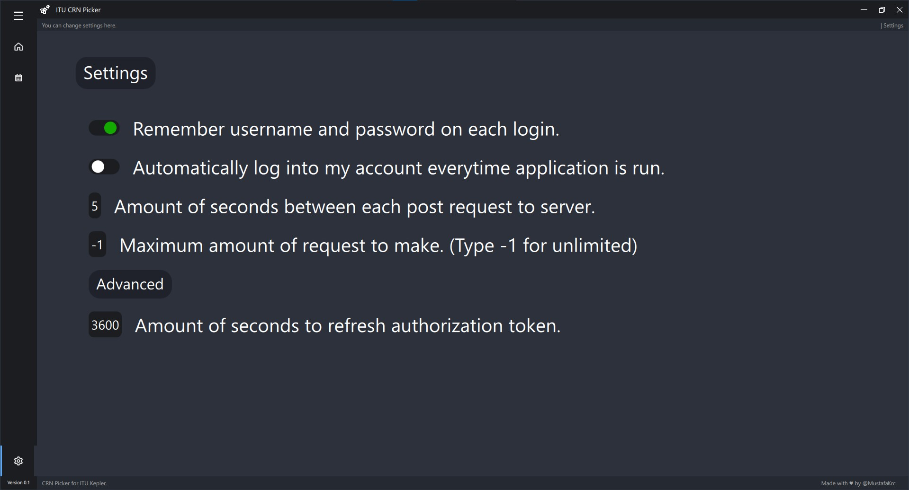
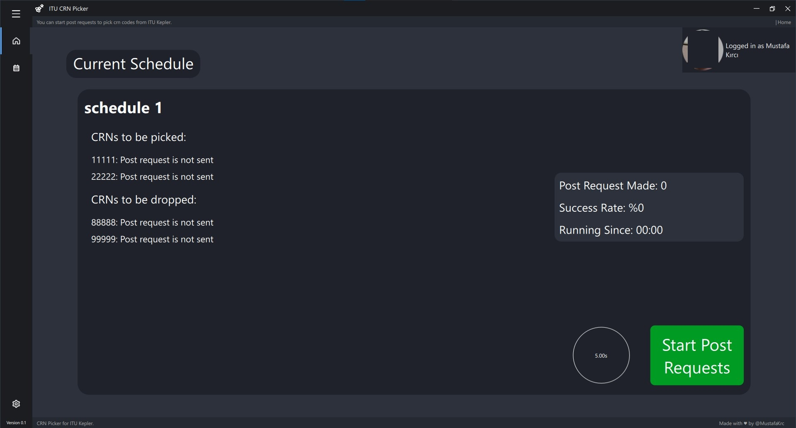

# ITU-CRN-Picker
Automatic crn picking application for ITU's kepler website.

## Table of Contents
* [General Information](#general-information)
* [How to Install](#how-to-install)
* [How to Use](#how-to-use)
* [Things You Should Know](#things-you-should-know)
* [Room for Improvement](#room-for-improvement)
* [Releases](#releases)
* [License](#license)

## General Information
This is an automated app to pick or drop CRNs from Istanbul Technical University's student information system (aka. kepler) website.

## How to Install
- You need to have **Python 3.\*** and **Google Chrome web browser** (preferably latest version) installed in your system.
- Following 3rd party libraries are needed:
    - PySide6
    - selenium
    - python-dotenv
    - requests
    - urrlib
    > You can use this command to install them in cmd via pip: `pip install -r requirements.txt`
    >> It is recommended to use virtual environment.
    
- Clone this repository to your computer.

## How to use
- Login with ITU information. 

- Create your schedule in `My Schedules`

- Change some settings based on your needs in `Settings`

- Press `Start Post Requests` button in `Home`
- Relevant information about each CRN is displayed in `Home`

## Things You Should Know
- You cannot send request to kepler more frequent than 1 seconds. Kepler system rejects the post request as a protection mechanism. That is why the maximum frequency to send request is set to 1.1 seconds in the source code.
- This app installs latest web driver for Chrome web browser when it is necessary. It is expected to take some time for download during first time start.

## Room for Improvement
- Schedule creation can be more interactive. User can select offered courses from drop-down menus using [this](https://github.com/itu-helper/data-updater) api.

> Feel free to report any bugs you encounter in this repository's issues page.

## Releases

Further releases will be listed here.

## License
This project is open source and available under the [GPLv3 License](./LICENSE).
